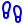
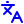

<picture>
  <source media="(prefers-color-scheme: dark)" srcset="assets/header-dark.svg">
  
</picture>

  <a href="https://falakpatel.com" title="Website"><picture><source media="(prefers-color-scheme: dark)" srcset="assets/icons/web-dark.svg"></picture></a>&nbsp;&nbsp;&nbsp;
  <a href="https://linkedin.com/in/falak-pat3l" title="LinkedIn"><picture><source media="(prefers-color-scheme: dark)" srcset="assets/icons/linkedin-dark.svg"></picture></a>&nbsp;&nbsp;&nbsp;
  <a href="https://scholar.google.com/citations?user=s6-Bs10AAAAJ" title="Google Scholar"><picture><source media="(prefers-color-scheme: dark)" srcset="assets/icons/scholar-dark.svg"></picture></a>&nbsp;&nbsp;&nbsp;
  <a href="https://x.com/falakpat3l" title="X"><picture><source media="(prefers-color-scheme: dark)" srcset="assets/icons/x-dark.svg"></picture></a>&nbsp;&nbsp;&nbsp;
  

### About me

I move ideas from the lab bench to working prototypes.

- <picture><source media="(prefers-color-scheme: dark)" srcset="assets/icons/pill-dark.svg"></picture> **Pharmacist by training:** B.Pharm (Pune University), registered pharmacist, regulatory and QA internships (FDA/EMA dossiers, GMP, GCP/ICH)
- <picture><source media="(prefers-color-scheme: dark)" srcset="assets/icons/device-dark.svg"></picture> **Medical device engineer:** M.Tech in Medical Device Innovation at IIT Hyderabad, built around the StrideMate exoskeleton
- <picture><source media="(prefers-color-scheme: dark)" srcset="assets/icons/clinic-dark.svg"></picture> **Clinic first:** 180+ hours of clinical immersion in orthopaedics and neurology before designing anything
- <picture><source media="(prefers-color-scheme: dark)" srcset="assets/icons/ai-dark.svg"></picture> **Now:** building privacy-first health tech (an offline step tracker and an e-paper health watch) and AI workflows where models check each other's work
- <picture><source media="(prefers-color-scheme: dark)" srcset="assets/icons/interests-dark.svg"></picture> **Interested in:** digital health, healthy ageing, and how innovation actually reaches patients
- <picture><source media="(prefers-color-scheme: dark)" srcset="assets/icons/languages-dark.svg"></picture> **Languages:** English, Hindi, Gujarati, Marathi (plus beginner German and Japanese)

### Projects

**Building now**

- [ink-health-watch](https://github.com/falakpat3l/ink-health-watch): open-source ESP32-S3 e-paper watch for steps, walking cadence and reminders. C++, PlatformIO.
- [stride-local](https://github.com/falakpat3l/stride-local): offline, ad-free Android step and health tracker. No internet permission, no account. Kotlin, Jetpack Compose.

**Earlier work**

- [stridemate-exoskeleton](https://github.com/falakpat3l/stridemate-exoskeleton): low-cost dual-ESP32 walking-assist exoskeleton, firmware and Wi-Fi dashboard.
- [exo-telemetry-tunnel](https://github.com/falakpat3l/exo-telemetry-tunnel): live gait dashboard for the exoskeleton, shareable over a Cloudflare tunnel.
- [Stridemate_3D_files_IITH](https://github.com/falakpat3l/Stridemate_3D_files_IITH): Fusion 360, STEP and STL files for the exoskeleton, prostheses and thumb designs.
- [persona-pipeline](https://github.com/falakpat3l/persona-pipeline): AI orchestration pipeline with a vision critic loop. Python, Gemini.
- [qr-nfc-clinical-trials](https://github.com/falakpat3l/qr-nfc-clinical-trials): B.Pharm thesis, clinical trial management with QR codes and NFC.

### Tools

Python · Kotlin · C++ (ESP32) · Fusion 360 · 3D printing · Gemini API · Git
