<!-- Made by folio/build.py from folio/profile.json. Edit those, then run: python3 folio/build.py -->

<picture><source media="(min-width: 1012px) and (prefers-color-scheme: dark)" srcset="assets/folio/name-dark.png" width="744" height="80" /><source media="(min-width: 1012px)" srcset="assets/folio/name-light.png" width="744" height="80" /><source media="(prefers-color-scheme: dark)" srcset="assets/folio/name-narrow-dark.png" /></picture>

<picture><source media="(min-width: 1012px) and (prefers-color-scheme: dark)" srcset="assets/folio/bio-wide-dark.png" width="744" height="54" /><source media="(min-width: 1012px)" srcset="assets/folio/bio-wide-light.png" width="744" height="54" /><source media="(prefers-color-scheme: dark)" srcset="assets/folio/bio-narrow-dark.png" /></picture>

<picture><source media="(prefers-color-scheme: dark)" srcset="assets/folio/divider-dark.png" /></picture>

  <a href="https://falakpatel.com" title="Website"><picture><source media="(prefers-color-scheme: dark)" srcset="assets/icons/web-dark.svg" /></picture></a>&nbsp;&nbsp;&nbsp;
  <a href="https://linkedin.com/in/falak-pat3l" title="LinkedIn"><picture><source media="(prefers-color-scheme: dark)" srcset="assets/icons/linkedin-dark.svg" /></picture></a>&nbsp;&nbsp;&nbsp;
  <a href="https://scholar.google.com/citations?user=s6-Bs10AAAAJ" title="Google Scholar"><picture><source media="(prefers-color-scheme: dark)" srcset="assets/icons/scholar-dark.svg" /></picture></a>&nbsp;&nbsp;&nbsp;
  <a href="https://x.com/falakpat3l" title="X"><picture><source media="(prefers-color-scheme: dark)" srcset="assets/icons/x-dark.svg" /></picture></a>

<picture><source media="(prefers-color-scheme: dark)" srcset="assets/folio/label-building-now-dark.png" /></picture>

<a href="https://github.com/falakpat3l/padachar"><picture><source media="(prefers-color-scheme: dark)" srcset="assets/folio/card-padachar-dark.png" />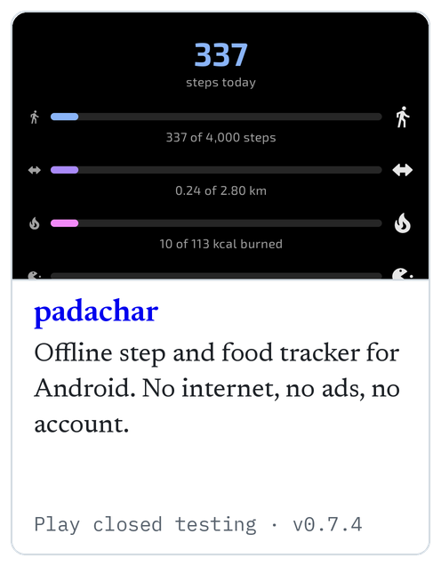</picture></a><a href="https://github.com/falakpat3l/anukalpa"><picture><source media="(prefers-color-scheme: dark)" srcset="assets/folio/card-anukalpa-dark.png" />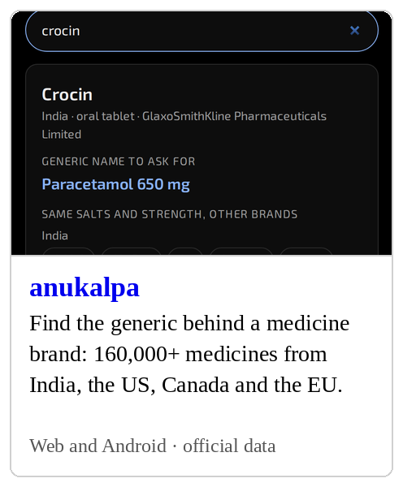</picture></a><a href="https://github.com/falakpat3l/device-class"><picture><source media="(prefers-color-scheme: dark)" srcset="assets/folio/card-device-class-dark.png" />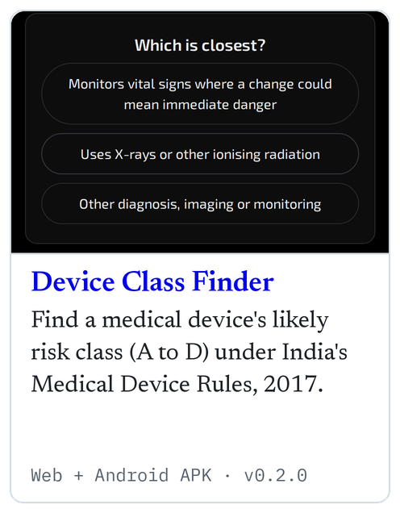</picture></a> <a href="https://github.com/falakpat3l/ink-health-watch"><picture><source media="(prefers-color-scheme: dark)" srcset="assets/folio/card-ink-health-watch-dark.png" />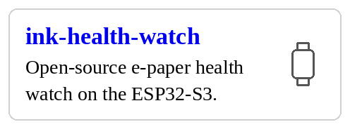</picture></a><a href="https://falakpatel.com"><picture><source media="(prefers-color-scheme: dark)" srcset="assets/folio/card-website-dark.png" />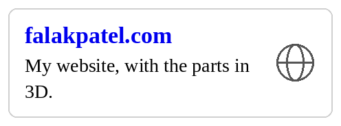</picture></a>

<picture><source media="(prefers-color-scheme: dark)" srcset="assets/folio/label-earlier-work-dark.png" /></picture>

<a href="https://github.com/falakpat3l/stridemate-exoskeleton"><picture><source media="(prefers-color-scheme: dark)" srcset="assets/folio/card-stridemate-dark.png" />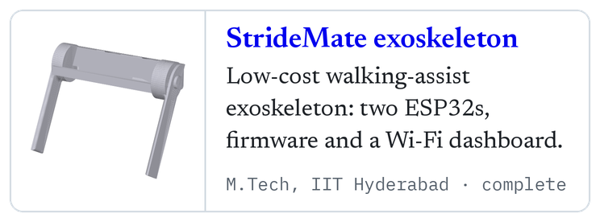</picture></a><a href="https://github.com/falakpat3l/qr-nfc-clinical-trials"><picture><source media="(prefers-color-scheme: dark)" srcset="assets/folio/card-qr-nfc-dark.png" /></picture></a> <a href="https://github.com/falakpat3l/exo-telemetry-tunnel"><picture><source media="(prefers-color-scheme: dark)" srcset="assets/folio/card-exo-telemetry-dark.png" />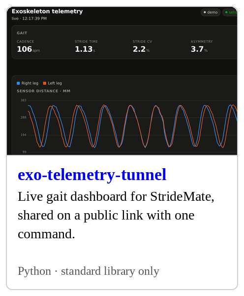</picture></a><a href="https://github.com/falakpat3l/persona-pipeline"><picture><source media="(prefers-color-scheme: dark)" srcset="assets/folio/card-persona-dark.png" />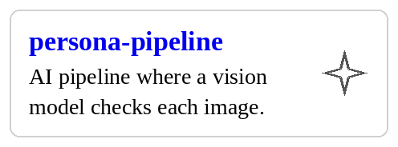</picture></a><a href="https://github.com/falakpat3l/Stridemate_3D_files_IITH"><picture><source media="(prefers-color-scheme: dark)" srcset="assets/folio/card-cad-dark.png" />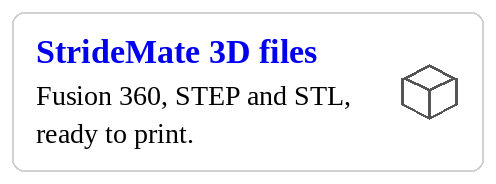</picture></a>

<a href="https://github.com/sponsors/falakpat3l"><picture><source media="(prefers-color-scheme: dark)" srcset="assets/folio/sponsor-dark.png" /></picture></a>

More about me

- <picture><source media="(prefers-color-scheme: dark)" srcset="assets/icons/pill-dark.svg"></picture> **Pharmacist by training:** B.Pharm (Pune University), registered pharmacist, regulatory and QA internships (FDA/EMA dossiers, GMP, GCP/ICH)
- <picture><source media="(prefers-color-scheme: dark)" srcset="assets/icons/device-dark.svg">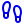</picture> **Medical device engineer:** M.Tech in Medical Device Innovation at IIT Hyderabad, built around the StrideMate exoskeleton
- <picture><source media="(prefers-color-scheme: dark)" srcset="assets/icons/clinic-dark.svg"></picture> **Clinic first:** 180+ hours of clinical immersion in orthopaedics and neurology before designing anything
- <picture><source media="(prefers-color-scheme: dark)" srcset="assets/icons/ai-dark.svg"></picture> **Now:** building privacy-first health tech: padachar (offline step tracker), anukalpa (brand to generic finder), Device Class Finder and an e-paper health watch, plus AI workflows where models check each other's work
- <picture><source media="(prefers-color-scheme: dark)" srcset="assets/icons/interests-dark.svg"></picture> **Interested in:** digital health, healthy ageing, and how innovation actually reaches patients
- <picture><source media="(prefers-color-scheme: dark)" srcset="assets/icons/languages-dark.svg">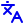</picture> **Languages:** English, Hindi, Gujarati, Marathi (plus beginner German and Japanese)

**Tools:** Python · Kotlin · C++ (ESP32) · Fusion 360 · 3D printing · Gemini API · Git

